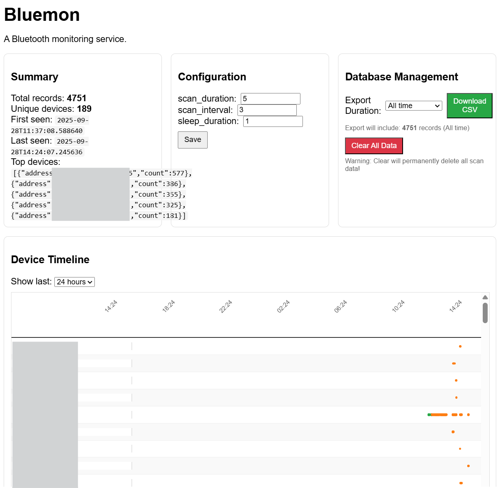

# Bluemon - Bluetooth Monitoring Service

A simple Bluetooth monitoring service which continuously scans for nearby devices, stores detection data in SQLite, and provides a web-based dashboard for analytics, visualization and data download. A collection of API endpoints are also supported.

**Note**: This software is designed for monitoring Bluetooth devices in environments where you have permission to do so. Please respect privacy and comply with local regulations regarding device monitoring.

## Features

- **Continuous Bluetooth Scanning**: Automatically discovers nearby Bluetooth devices
- **Data Persistence**: Stores device detection data with timestamps and RSSI values
- **Web Dashboard**: Real-time analytics with interactive timeline visualization
- **APIs**: Basic APIs to access data and perform operations via external tools
- **CSV Export**: Download scan data for analysis in external tools
- **Configuration Management**: Runtime configuration updates via web interface
- **Docker Support**: Containerized deployment with health checks
- **Timeline Visualization**: Gantt chart-style view of device presence over time
- **Database Management**: Clear data and export capabilities

## Overview



The web dashboard provides:
- Real-time summary statistics
- Interactive device timeline (Gantt chart)
- Recent scan results table
- Configuration management
- Data export and database management tools

## Requirements

- Python 3.8+
- Bluetooth adapter (built-in or USB)
- Linux/macOS (Windows support via Docker)

### System Dependencies

- `bluetooth` package
- `libbluetooth-dev`
- `pkg-config`
- `gcc` (for compiling native extensions)

## Installation

### Method 1: Docker (Recommended)


```
# Build the image
docker build -t bluemon .

# Run with persistent data storage
docker run -d
--name bluemon
--privileged
-p 8080:8080
-v bluemon-data:/app/data
bluemon
``` 

The `--privileged` flag is required for Bluetooth access in containers.

### Method 2: Local Installation

1. **Clone the repository**
   ```bash
   git clone <repository-url>
   cd bluemon
   ```

2. **Install system dependencies** (Ubuntu/Debian)
   ```bash
   sudo apt-get update
   sudo apt-get install bluetooth libbluetooth-dev pkg-config gcc
   ```

3. **Create virtual environment**
   ```bash
   python3 -m venv .venv
   source .venv/bin/activate  # On Windows: .venv\Scripts\activate
   ```

4. **Install Python dependencies**
   ```bash
   pip install -r requirements.txt
   ```

5. **Run the application**
   ```bash
   python bluemon.py
   ```

## Usage

### Starting the Service

After installation, start Bluemon:

```bash
python bluemon.py
```

The service will:
* Initialize and test Bluetooth connectivity
* Create a SQLite database (bluemon.sqlite)
* Start the web interface on http://localhost:8080
* Begin continuous Bluetooth scanning 

### Web Interface
Navigate to http://localhost:8080 to access the dashboard:
* Summary: View total records, unique devices, and top detected devices
* Configuration: Adjust scan parameters in real-time
* Device Timeline: Interactive Gantt chart showing device presence over time
* Recent Scans: Table of latest device detections
* Database Management: Export data to CSV or clear the database

### Configuration
The service uses a JSON configuration file (config.json) with the following parameters:``` json
```
{
  "scan_duration": 5,     // How long each scan lasts (seconds)
  "scan_interval": 3,     // Time between scans (seconds)  
  "sleep_duration": 1,    // Main loop sleep duration (seconds)
  "db_path": "bluemon.sqlite",  // SQLite database path
  "host": "0.0.0.0",      // Web interface bind address
  "port": 8080            // Web interface port
}
```

Configuration can be modified:
* Via the web interface (runtime changes) - by editing config.json directly (requires restart)
Using environment variable BLUEMON_CONFIG to specify config file path

### API Endpoints
Bluemon exposes several REST API endpoints:

```
GET /api/health - Health check for monitoring
GET /api/summary - Analytics summary
GET /api/recent?limit=N - Recent scan results
GET /api/timeline?hours=N - Timeline data for visualization
GET /api/config - Current configuration
POST /api/config - Update configuration
GET /api/export-csv?hours=N - Export data as CSV
POST /api/clear-data - Clear all scan data
```

### Data Export
Export scan data in CSV format:
* Use the web interface "Database Management" section
* Select time range (1 hour to all time)
* Click "Download CSV"

* Or use the API directly (for example):
``` bash
# Export last 24 hours
curl "http://localhost:8080/api/export-csv?hours=24" -o export.csv

# Export all data
curl "http://localhost:8080/api/export-csv" -o export_all.csv
```

## Architecture
``` 
bluemon/
├── bluemon.py              # Main application entry point
├── module/
│   ├── bluetooth_scanner.py # Bluetooth scanning logic
│   ├── config.py           # Configuration management
│   ├── store.py            # SQLite database operations
│   └── web.py              # Flask web interface
├── static/
│   └── style.css           # Web interface styling
├── requirements.txt        # Python dependencies
└── Dockerfile             # Container configuration
```

Key Components
* BluetoothScanner: Handles device discovery using the bleak library
* Store: SQLite database operations and data persistence
* Web Interface: Flask-based dashboard with real-time updates
* Configuration: JSON-based configuration with runtime updates

### Development
Running in Development Mode``` bash
# Install development dependencies
```
pip install -r requirements.txt
```

# Run with debug logging
```
PYTHONPATH=. python bluemon.py
```

The modular architecture makes it easy to extend:
* New scan data fields: Modify BluetoothDevice dataclass and database schema
* Additional visualizations: Add new API endpoints and frontend components
* Custom exporters: Extend the Store class with new export methods
* Integration: Use the API endpoints to integrate with other systems

## Troubleshooting
Common Issues encountered.

#### No Bluetooth adapter found
* Ensure Bluetooth is enabled: sudo systemctl start bluetooth
* Check adapter status: bluetoothctl show
* Permission denied errors
* Add user to bluetooth group: sudo usermod -a -G bluetooth $USER
Or run with sudo (not recommended for production)

#### Docker Bluetooth access
* Ensure --privileged flag is used
* Host Bluetooth service must be running

#### Web interface not accessible
* Check if port 8080 is available
* Verify firewall settings
* Check application logs for binding errors

## Logs and Debugging
* Application logs are printed to stdout
* Use docker logs bluemon for containerized deployments
* Enable debug logging by modifying the logging level in bluetooth_scanner.py

## Performance Considerations
* Scan frequency: Higher frequency provides more data but uses more resources
* Database size: Monitor SQLite file size; use CSV export and clear for maintenance
* Memory usage: Long-running instances accumulate scan data in memory
* Concurrent access: SQLite handles multiple readers but single writer

## Security
* Web interface has no authentication (design for local/trusted networks)
* SQLite database contains device MAC addresses and names
* Consider network isolation for production deployments
* Regular data exports and cleanup recommended for privacy

## Contributing
* Fork the repository
* Create a feature branch
* Make changes with appropriate tests
* Submit a pull request with clear description

Please ensure:
* Code follows existing style conventions
* New features include appropriate documentation
* Changes are tested on target platforms

### Attribution

When sharing or modifying this code, please maintain attribution to the original authors and include the above license notice.

## Acknowledgments
- Built with [bleak](https://github.com/hbldh/bleak) for cross-platform Bluetooth LE support
- Web interface powered by [Flask](https://flask.palletsprojects.com/)
- Production WSGI server via [Waitress](https://docs.pylonsproject.org/projects/waitress/)
- Data persistence with SQLite
- Written in Python 3.12 by [Kasp0r](https://github.com/kasp0r)

## Support
For issues, feature requests, or questions:
1. Check the troubleshooting section above
2. Search existing issues in the repository
3. Create a new issue with detailed information about your environment and problem

